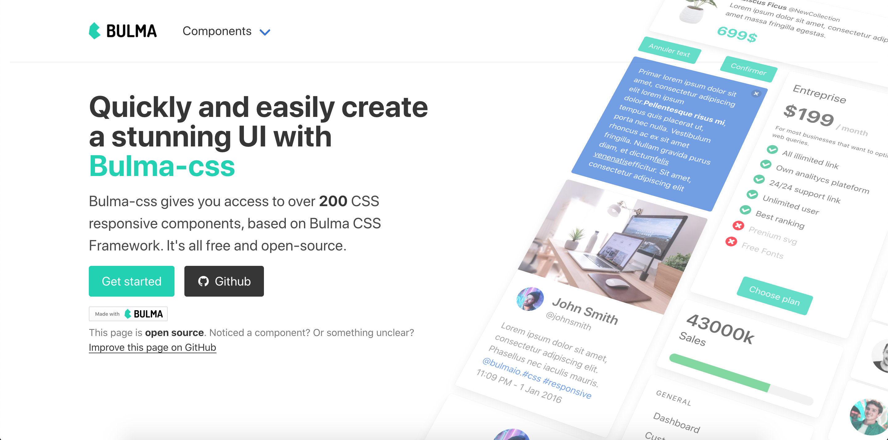
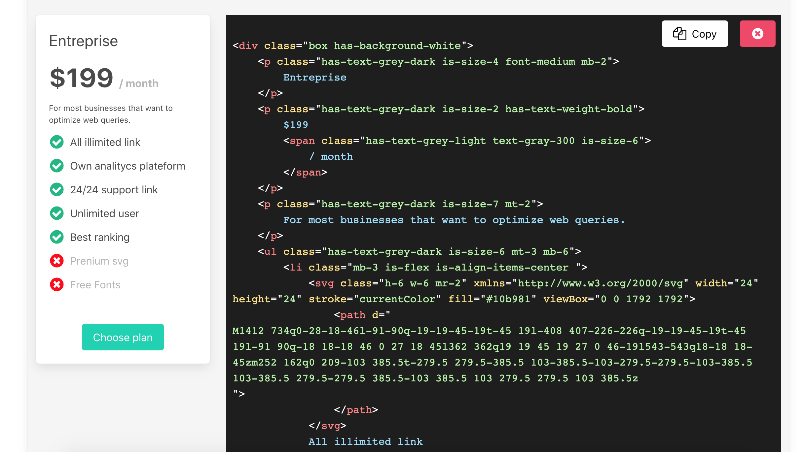
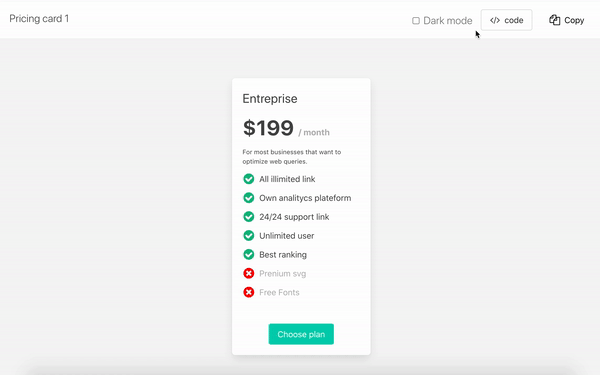
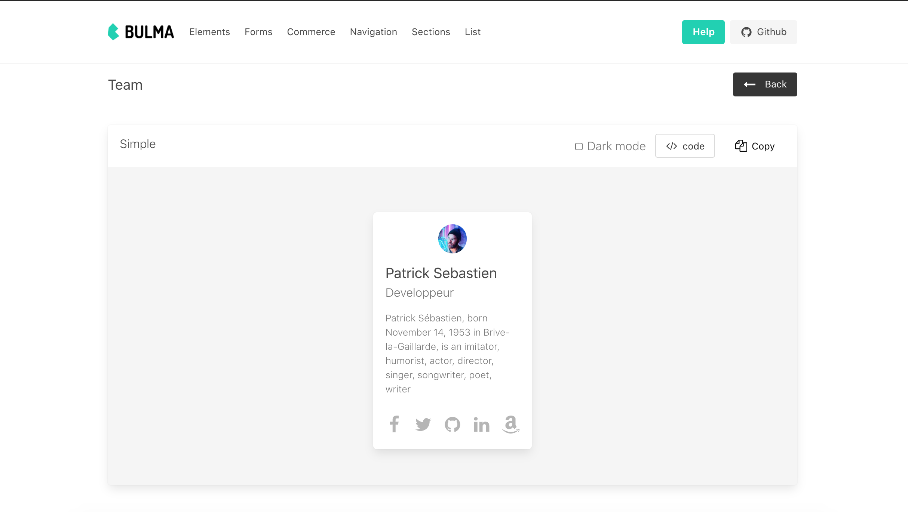

# [Bulma CSS](https://bulma-css.com/)

> Open-source project - provided by [AppSeed](https://appseed.us) under [EULA](./LICENSE.md) license.

- [Bulma CSS Components](https://components.bulma-css.com/) - LIVE Demo

<br />

**Initially coded by [Charlie Rabiller](https://www.linkedin.com/in/crabiller/)** - the creator of [Tailwind-kit](https://www.tailwind-kit.com/). 

<br />
  

   <a  href="https://components.bulma-css.com/"  target="_blank">



</a>

### A beautiful and large components kit for Bulma
  

Bulma CSS is Free and Open Source. It does not change or add any CSS to the already one from Bulma Framework. It features multiple HTML elements that can be used in all web projects who's use Bulma CSS.
  

## CSS Components
  

Bulma Css comes with 18+ Fully Coded CSS elements and layouts.

 

## Live code editor




Bulma-css include a live code editor to change the components code and see in live the modification.

  

## Dark mode



 

Most components are implemented with a light and dark version.
  

## Documentation

For documentation please access [Bulma Components](https://components.bulma-css.com/started).


## Browser Support
  

At present, we officially aim to support the last two versions of the following browsers:

  

| Chrome | Firefox | Edge | Safari | Opera |


         

   
 

## Getting Started

  


  
  

Bulma-css is a static site build with [Next.js](https://nextjs.org/) and typescript.

### Prerequisites: 

Node.js 10.13 or later 

Recommanded : **Node v12.18.3** 

### Run the project: 

Install dependencies:

  

```bash

npm install

# or

yarn install

```

  

Run the development server:

  

```bash

npm run dev

# or

yarn dev

```

  

Open [http://localhost:3000](http://localhost:3000) with your browser to see the result.

  

You can start editing the page by modifying `pages/_index.tsx`. The page auto-updates as you edit the file (static folder : /out).

  
  

Build the static site:

  

```bash

npm run build

# or

yarn build

```


## 🧐 What's inside?

A quick look at the important repo files and directories you'll see in a the project.

    .
    ├── node_modules
    ├── public
    ├── pages
    ├── components
    	 ├── kit
         ├── layout
         ├── site
    ├── utils
    ├── editorTheme.tsx
    ├── global.scss
    ├── LICENSE
    ├── next.config.json
    ├── package.json
    ├── README
    ├── tsconfig.json
    ├── .gitignore
    └── yarn.lock.json

1.  **`/node_modules`**: This directory contains all of the modules of code that your project depends on (npm packages) are automatically installed.

1.  **`/public`**: This directory contain all the public assets that need the project (images, icons).

1.  **`/pages`**: This directory contain all pages of the app. See [NextJs pages documentation](https://nextjs.org/docs/basic-features/pages/) for more details

1.  **`/components`**: This directory contain all components of the app. 
	1. **kit** : contains all components used for demonstration/preview. Components are sorted by section (Commerce, Elements, Forms ...). Each section have his directory. 
	1. **layout** : contains all layout used in the application. See [NextJs layout documentation](https://nextjs.org/learn/basics/assets-metadata-css/layout-component) for more details
	1. **site** : contains all component used for the structure of the application (header, footer, home, ...)

1.  **`/utils`**: This directory contain all utils classes, like html parser, html beautifier (use to indent the components code on preview)

1.  **`editorTheme.tsx`**: This file is the configuration theme (colors) for the components code preview. See [react-prism](https://github.com/FormidableLabs/prism-react-renderer#theming) for more details

1.  **`global.scss`**: This scss file contain all the 'custom' css use for the app. This file is not used for bulma components and not override any bulma classes.  

1.  **`LICENSE`**: Bulma-css is licensed under the MIT license.

1.  **`next.config.json`**: This file contain all the nextJS configuration. Here we use the default one.

1. **`package.json`**: A manifest file for Node.js projects, which includes things like metadata (the project’s name, author, etc). This manifest is how npm knows which packages to install for your project.

1. **`README.md`**: A text file containing useful reference information about your project.

1.  **`tsconfig.json`**: The presence of a tsconfig.json file in a directory indicates that the directory is the root of a TypeScript project. The tsconfig.json file specifies the root files and the compiler options required to compile the project.

1.  **`.gitignore`**: This file tells git which files it should not track / not maintain a version history for.

1. **`yarn-lock.json`** (See `package.json` below, first). This is an automatically generated file based on the exact versions of your npm dependencies that were installed for your project. **(You won’t change this file directly).**

## 📋 Create a new section 

Components are sorted by category.

Categories are sorted by section. 

A section can have one or more category.

Category can have one or more component.

To add a new main section like ***Commerce, Element, Form*** .. you must : 
1.  Create your new directory in **components/kit/components/{yourSectionName}**. It's inside this directory that you will put all your components files.
	  
2.  Create a **index.tsx** file on this new directory. It will contain the description (categories names, components numbers, title, ....) of the section. See other section files for an example.   
2.  Each time you want create a new category on a section you will need create a directory in the directory of this one. Then you will put the component file in the category directory. 

See an example : 


    
    ├── components
    	 ├── kit
         	├── components
            	├── MyNewSection // section directory
                	index.tsx // section description file
                	├── MyCategory // category directory
                    		MyComponent.tsx // My component source file
                            MyComponent2.tsx // My component source file
                            ....
                
         ├── layout
         ├── site
    ├── ...
    └── ...


##  📁 Create a new category

As seen just above, to create a new category you need to create a directory on a section that will contains your components. We also need to create the category page.
1.  Create your new directory in **pages/components/{yourCategoryName}**. It's inside this directory that we will put the category page code.
	  
2.  Create a **index.tsx** file on this new directory. It will contain all the components that we want import and see in this category. See other category files for an example.   
2.  When index.tsx is created NextJs create a route for this category that we can see on : http://localhost:3000/components/{yourCategoryName}


## ➕ Create a new component

Components are classics React functional component.


### dark/light mode

If you want that your component have a dark version, you need to declare a props `isDark` which is a boolean, not mandatory.
Then you need to declare the classes used for each version (light/dark) and use it on the code in function of the `isDark` props. Ex : 

```JSX
import React from "react";

interface Props {
  label: string;
  isDark?: boolean;
  isLoading?: boolean;
}
const theme = {
  dark: {
    background: "is-dark",
  },
  light: {
    background: "is-primary",
  },
};
const Button = ({ label, isDark, isLoading }: Props) => {
  const mode = isDark ? "dark" : "light";
  return (
    <button
      className={`button ${theme[mode].background} ${
        isLoading ? "is-loading" : ""
      }`}
    >
      {label}
    </button>
  );
};
export default Button;
```


### Import the component

The last thing to do is to import your component on the wanted category file : **(/pages/components/{category}/index.tsx)**

To enabled all feature preview like live edition, dark mode, ... you need to pass our component to `ComponentLayout`.

 `ComponentLayout` is the layout who will add all buttons (Code, Copy, Dark mode) and the live edition feature on our component.
 
**`ComponentLayout`** take few props :  

- `element`: The JSX.Element of our component
- `component`: The component 
- `title`: The title of the component display on the panel
- `jsLink`: The link of the component codeon github (if need JS to work)
- `vertical`: Boolean if the code preview is display on side of the component or below
- `hasDarkMode`: Boolean if the component have dark/light implementation (Display or hide the dark mode checkbox)
- `containerClasses`: Classes to add on the container of the component (ex : add margin, padding ...)
-  containerWidth?: The container width (6 = 50%, 12=100%)

| propName    | propType      | defaultValue | isRequired |
| ----------- | ------------- | ------------ | ---------- |
| element | JSX.Element        |              | x          |
| component       |         |              | x          |
| title | string       |          | x          |
| jsLink    | string|              |          |
| vertical    | boolean|        false      |          |
| hasDarkMode    | boolean|        false      |          |
| containerClasses    | string|              |          |
| containerWidth    | number (1 to 12)|      12        |          |


Example of the `index.tsx` file of the **team** category :

```JSX
import React, { FC } from "react";
import AppLayout from "../../../components/layout/AppLayout";
import SectionHeader from "../../../components/site/header/SectionHeader";
import ComponentLayout from "../../../components/layout/ComponentLayout";
import SimpleTeam from "../../../components/kit/components/pagesection/team/SimpleTeam";

const TeamPage: FC = () => {
  return (
    <AppLayout
      title="Teams section free Bulma components"
      desc="Teams and more components for Bulma css"
    >
      <SectionHeader title="Team" />
      <ComponentLayout
        title="Simple"
        hasDarkMode={true}
        containerWidth={3}
        element={<SimpleTeam />}
        component={SimpleTeam}
      />
    </AppLayout>
  );
};

export default TeamPage;

```


This render on http://localhost:3000/components/team





## Learn More

  

To learn more about Next.js, take a look at the following resources:

  

-  [Next.js Documentation](https://nextjs.org/docs) - learn about Next.js features and API.

-  [Learn Next.js](https://nextjs.org/learn) - an interactive Next.js tutorial.

  

You can check out [the Next.js GitHub repository](https://github.com/vercel/next.js/) - your feedback and contributions are welcome!

  
  

## Licensing

- Licensed under [EULA](./LICENSE.md).

---
Bulma CSS Components - Open-Source project provided by [AppSeed](https://appseed.us).
